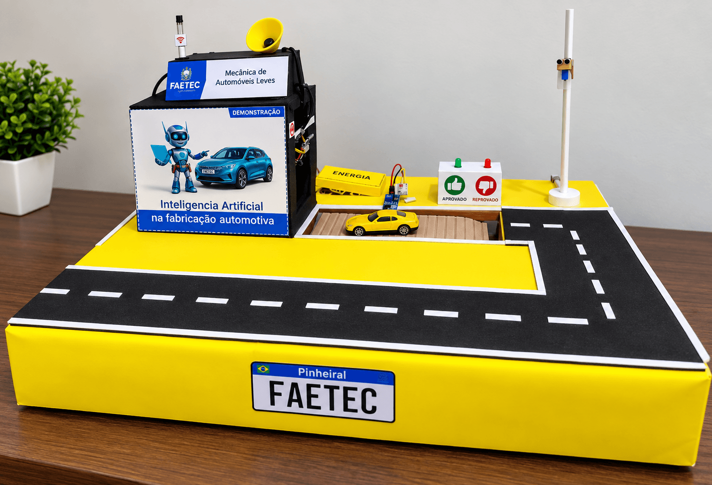
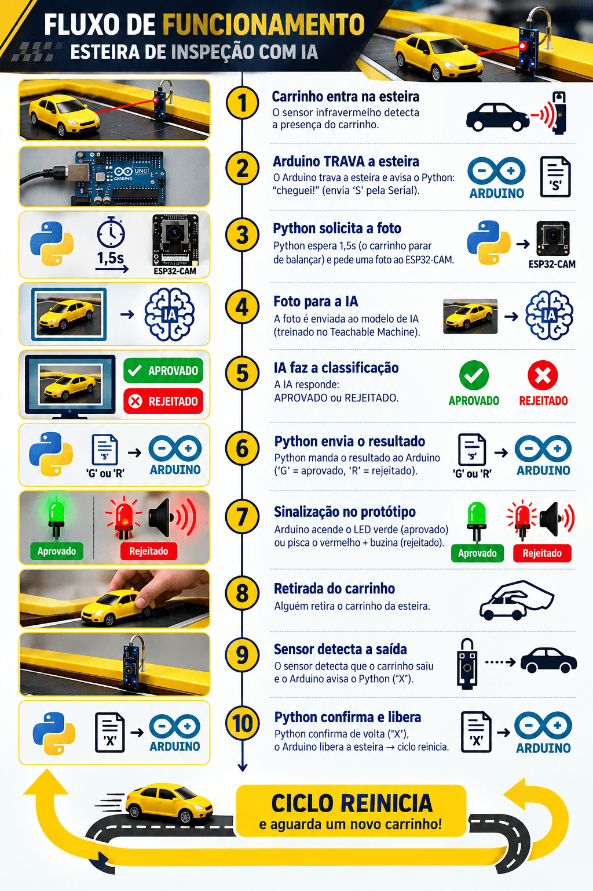
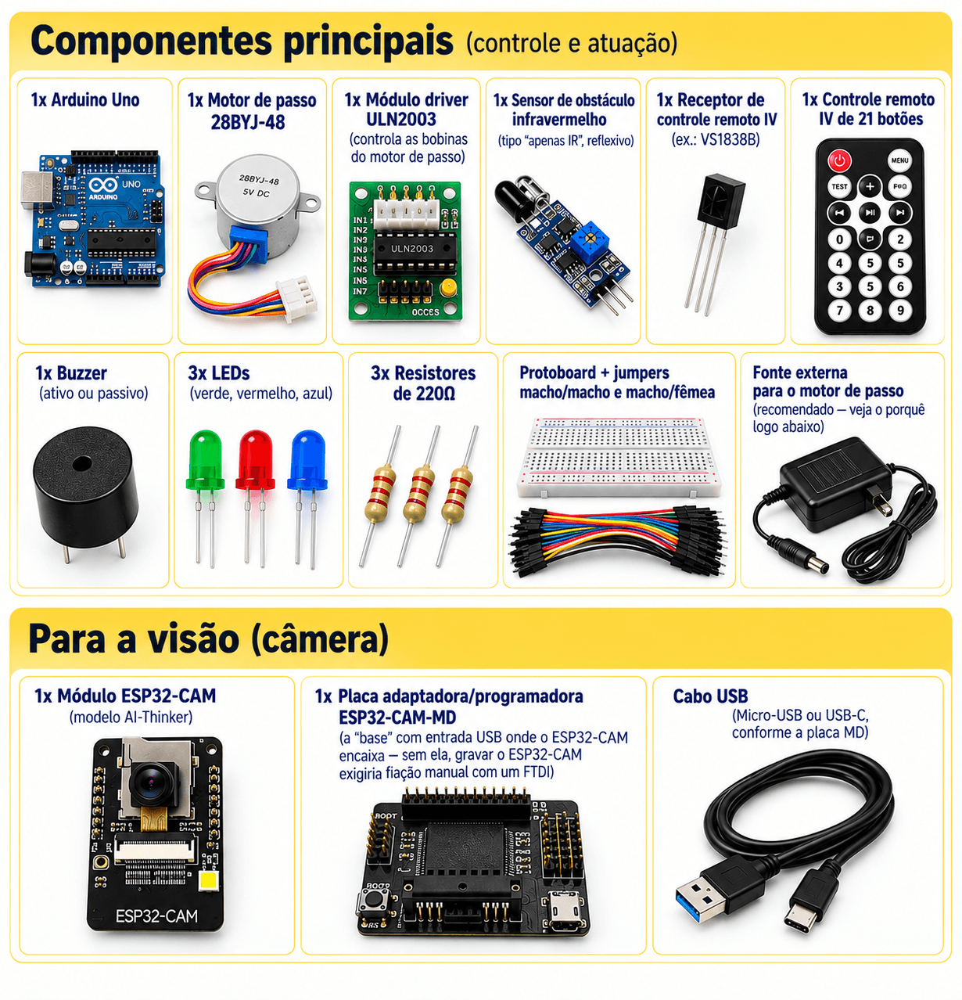

<div align="center">

# 🚗 Montadora de Carros com Inteligência Artificial

**Uma linha de montagem em miniatura que usa visão computacional para aprovar ou reprovar carrinhos, automaticamente.**




</div>

## O que é isso?

Imagine uma fábrica de carros de verdade: os carros passam por uma esteira, uma inspeção verifica se está tudo certo, e só então eles seguem para o próximo estágio. Este projeto recria essa ideia em uma **maquete**, usando um carrinho de brinquedo:

1. O carrinho anda sobre uma esteira controlada por um **Arduino Uno**.
2. Uma **câmera (ESP32-CAM)** presa acima da esteira fotografa o carrinho na estação de inspeção.
3. Um **programa em Python**, com um modelo de **Inteligência Artificial treinado no Teachable Machine**, olha para essa foto e decide: ✅ **Aprovado** ou ❌ **Rejeitado**.
4. O resultado volta para o Arduino, que acende o LED certo, toca a buzina se for o caso, e libera a esteira para o próximo carrinho.

Este README vai te guiar por **tudo**: montar o hardware, instalar os softwares, configurar cada arquivo e treinar a própria IA — mesmo que você nunca tenha feito nada parecido antes.

> 🎓 Projeto desenvolvido para o curso de Mecânica de Automóveis Leves — FAETEC Pinheiral.

---

## 📋 Sumário

- [Visão geral rápida](#-visão-geral-rápida)
- [Como o sistema pensa (a lógica por trás)](#-como-o-sistema-pensa-a-lógica-por-trás)
- [Estrutura do repositório](#-estrutura-do-repositório)
- [Peças e materiais necessários](#-peças-e-materiais-necessários)
- [Ligações elétricas (Arduino)](#-ligações-elétricas-arduino)
- [Montando a maquete física](#-montando-a-maquete-física)
- [Passo 1 — Preparar o Arduino Uno](#-passo-1--preparar-o-arduino-uno)
- [Passo 2 — Preparar o ESP32-CAM](#-passo-2--preparar-o-esp32-cam)
- [Passo 3 — Configurar o Wi-Fi do ESP32-CAM](#-passo-3--configurar-o-wi-fi-do-esp32-cam)
- [Passo 4 — Preparar o Python](#-passo-4--preparar-o-python)
- [Passo 5 — Treinar a Inteligência Artificial](#-passo-5--treinar-a-inteligência-artificial)
- [Passo 6 — Rodar o projeto](#-passo-6--rodar-o-projeto)
- [Onde mexer para configurar tudo](#-onde-mexer-para-configurar-tudo)
- [Comunicação Serial: como Arduino e Python conversam](#-comunicação-serial-como-arduino-e-python-conversam)
- [Problemas comuns](#-problemas-comuns)

---

## 🔍 Visão Geral Rápida

O projeto é dividido em três partes, cada uma com um papel bem definido:

| | Parte | Onde fica | O que faz |
|---|---|---|---|
| 🦾 | **Arduino Uno** | Dentro da maquete | Move a esteira, lê o sensor de presença, controla LEDs/buzina e obedece ao controle remoto. É o "corpo". |
| 📷 | **ESP32-CAM** | Em cima da esteira | Filma a esteira e tira fotos sob comando. São os "olhos". |
| 🧠 | **Python + IA** | No notebook | Olha a foto, decide aprovado/rejeitado e manda a ordem de volta pro Arduino. É o "cérebro". |

Nenhuma parte funciona sozinha do jeito esperado — as três precisam estar ligadas e configuradas corretamente ao mesmo tempo.

---

## 🧠 Como o Sistema Pensa (a lógica por trás)

Este é o ciclo completo, do carrinho chegando até ele sair da inspeção:

<div align="center">



</div>

Se o sistema for **desligado no controle remoto** a qualquer momento, o Arduino manda um sinal de reset total (`Z`) e o Python descarta qualquer análise em andamento.

<details>
<summary>💡 Curiosidade técnica: como o sistema evita se confundir com respostas atrasadas</summary>

<br>

A busca da foto e a análise da IA rodam em uma tarefa separada, em paralelo, para a tela de vídeo não travar enquanto a IA "pensa". Para evitar que uma resposta atrasada de um ciclo antigo seja aplicada por engano depois de um reset, o Python usa um contador interno (`geracao_sistema`). Toda vez que o sistema reinicia, esse número muda — e qualquer resultado que chegue com o número antigo é simplesmente ignorado.

</details>

---

## 📁 Estrutura do Repositório

```
Montadora_Carro_Ia/
├── Arduino/
│   ├── Arduino.ino          # Lógica principal: esteira, sensores, LEDs, controle remoto, Serial
│   └── Perifericos.ino      # Funções auxiliares (LED, som, sensor, motor)
│
├── ESP32-CAM/
│   ├── ESP32-CAM.ino        # Configura a câmera, conecta ao Wi-Fi e sobe o servidor de streaming
│   ├── config.h             # ⚙️ PAINEL DE CONFIGURAÇÃO: Wi-Fi e IP do ESP32-CAM
│   └── app_httpd.cpp        # Servidor HTTP (rotas /stream, /capture, /capturar_com_flash...)
│
├── Python/
│   ├── main.py              # Programa principal (vídeo, Serial, máquina de estados)
│   ├── classificador.py     # Carrega o modelo de IA e classifica cada imagem
│   ├── constantes.py        # Lê o config.ini e centraliza as constantes do sistema
│   ├── interface.py         # Desenha a barra de status na janela de vídeo
│   ├── config.ini           # ⚙️ PAINEL DE CONFIGURAÇÃO: IP da câmera, porta serial, modo simulador
│   ├── requirements.txt     # Bibliotecas Python necessárias
│   └── IA/
│       ├── consertar_modelo.py        # Converte o modelo baixado do Teachable Machine
│       ├── modelo_ia_atualizado.keras # Modelo já convertido (pronto para uso)
│       └── labels.txt                 # Nome das classes, na ordem do treinamento
│
└── Asserts/
    ├── Driver/CH341SER.ZIP  # Driver USB-Serial (essencial no Windows)
    └── Alimentar AI/Fotos para treinar a IA/
        ├── APROVADOS/        # Fotos de carrinhos "bons" para treinar a IA
        └── REJEITADOS/       # Fotos de carrinhos "com defeito" para treinar a IA
```

---

## 🧰 Peças e Materiais Necessários

### Para o Arduino (mecânica e sensores)

- [ ] 1x **Arduino Uno**
- [ ] 1x Motor de passo **28BYJ-48**
- [ ] 1x Módulo driver **ULN2003** (controla as bobinas do motor de passo)
- [ ] 1x Sensor de obstáculo infravermelho (tipo "apenas IR", reflexivo)
- [ ] 1x Receptor de controle remoto IV (ex.: VS1838B)
- [ ] 1x Controle remoto IV de 21 botões (os códigos já vêm mapeados no código — [veja aqui](#-onde-mexer-para-configurar-tudo))
- [ ] 1x Buzzer ativo ou passivo
- [ ] 3x LEDs (verde, vermelho, azul)
- [ ] 3x Resistores de 220Ω
- [ ] Protoboard + jumpers macho/macho e macho/fêmea
- [ ] Fonte externa para o motor de passo (recomendado — veja o porquê [logo abaixo](#-ligações-elétricas-arduino))

### Para a visão (câmera)

- [ ] 1x Módulo **ESP32-CAM** (modelo AI-Thinker)
- [ ] 1x Placa adaptadora/programadora **ESP32-CAM-MD** *(a "base" com entrada USB onde o ESP32-CAM encaixa — sem ela, gravar o ESP32-CAM exigiria fiação manual com um FTDI)*
- [ ] Cabo USB (Micro-USB ou USB-C, conforme a placa MD)

### Para a maquete

- [ ] Base (madeira, isopor ou papelão reforçado)
- [ ] EVA ou courino para forrar a base e desenhar a "pista"
- [ ] Estrutura vertical para sustentar o ESP32-CAM acima da esteira
- [ ] Carrinhos de brinquedo em miniatura



---

## 🔌 Ligações Elétricas (Arduino)

| Componente | Pino no Arduino Uno | Tipo | Descrição |
|---|:---:|:---:|---|
| Sensor IV de obstáculo | `6` | Entrada | Detecta o carrinho na estação de inspeção |
| LED Verde | `8` | Saída | Aceso = item aprovado |
| LED Vermelho | `9` | Saída | Piscando = item rejeitado |
| LED Azul | `11` | Saída | Aceso = sistema ligado |
| Buzzer | `10` | Saída | Alerta sonoro quando um item é rejeitado |
| Receptor IV (controle remoto) | `2` | Entrada | Recebe o sinal do controle remoto |
| Driver ULN2003 — IN1 | `3` | Saída | Bobina A do motor de passo |
| Driver ULN2003 — IN2 | `4` | Saída | Bobina B do motor de passo |
| Driver ULN2003 — IN3 | `5` | Saída | Bobina C do motor de passo |
| Driver ULN2003 — IN4 | `12` | Saída | Bobina D do motor de passo |

> ⚠️ Todos os GNDs (Arduino, driver ULN2003, sensor, receptor IV e alimentação externa do motor) precisam estar interligados.

> 💡 **Dica importante: alimente o motor com uma fonte externa, não pelo pino 5V do Arduino**
>
> O motor de passo 28BYJ-48 pode consumir bem mais corrente do que os cerca de 200 mA que o pino 5V do Arduino Uno consegue fornecer com segurança — principalmente quando ele está girando ou segurando a esteira parada com torque. Se você alimentar o driver ULN2003 direto pelo 5V do Arduino, o regulador de tensão da placa esquenta, o Arduino pode reiniciar sozinho no meio do ciclo, o vídeo/Serial pode "engasgar", e a longo prazo isso desgasta o componente.
>
> **Como ligar a fonte externa:**
> 1. Use uma fonte de **5V** com pelo menos **1A** de capacidade — por exemplo, um carregador de celular USB antigo (ligando o fio + e - que saem dele), uma fonte de bancada, ou um porta-pilhas 4x AA/AAA (~5V).
> 2. Ligue o **positivo (+)** dessa fonte no terminal de alimentação **"+"** da placa driver ULN2003 (esse terminal fica ao lado dos pinos IN1–IN4, é diferente deles — **não** é onde entram os fios de sinal do Arduino).
> 3. Ligue o **negativo (-)** dessa fonte no terminal **"-"** da mesma placa **e também** em um pino **GND do Arduino**, com um fio extra — isso cria o "GND comum" mencionado no aviso acima. Sem esse GND compartilhado, os sinais IN1–IN4 do Arduino não conseguem controlar o motor corretamente.
> 4. O pino **5V do Arduino** fica livre para alimentar só os sensores e os LEDs (que consomem bem pouca corrente), sem risco de sobrecarga.
>
> Se o motor só vai girar por pouco tempo e em testes de bancada, alimentá-lo pelo 5V do Arduino até funciona — mas para a maquete rodando por mais tempo, a fonte externa é o jeito certo de evitar resets aleatórios e proteger a placa.

---

## 🏗️ Montando a Maquete Física

1. **Base e pista:** monte a base e forre com EVA/courino. Desenhe ou cole a "pista de asfalto" em EVA preto com faixas brancas.
2. **Esteira:** instale o motor de passo por baixo da pista, de forma que ele movimente a esteira/plataforma por onde o carrinho passa.
3. **Sensor de presença:** posicione o sensor infravermelho exatamente na estação de inspeção — o ponto onde o carrinho deve parar para ser fotografado.
4. **Estrutura da câmera:** monte um suporte/caixa acima da estação de inspeção e fixe o ESP32-CAM olhando de cima para baixo, enquadrando bem o ponto de parada.
5. **Painel de indicação:** posicione os LEDs e o buzzer em um local visível.
6. **Receptor IV:** deixe-o com visada livre, sem obstáculos.
7. **Eletrônica:** monte o Arduino e o driver ULN2003 conforme a tabela de ligações, escondidos dentro da base — e já deixe a fonte externa do motor (veja a dica acima) com fácil acesso para ligar/desligar.
8. **Cabos:** leve o cabo USB do Arduino até o notebook e alimente o ESP32-CAM.

---

## 🔧 Passo 1 — Preparar o Arduino Uno

### 1.1 Instale o driver USB (necessário no Windows)

A maioria dos Arduino Uno (e placas parecidas) usa um chip **CH340/CH341** para se comunicar via USB. O Windows não vem com esse driver por padrão — sem ele, o computador não cria a porta COM e nada consegue se conectar.

📦 O instalador está incluído no próprio repositório: **`Asserts/Driver/CH341SER.ZIP`**

1. Extraia o `.zip`.
2. Rode o instalador como administrador e clique em **INSTALL**.
3. Conecte o Arduino e confira no **Gerenciador de Dispositivos → Portas (COM e LPT)** se apareceu algo como `USB-SERIAL CH340 (COM3)`.
4. **Anote o número da porta COM** — você vai usar isso mais adiante, no arquivo `Python/config.ini`.

### 1.2 Instale a Arduino IDE

Baixe em [arduino.cc/en/software](https://www.arduino.cc/en/software) (recomendado: versão 2.x).

### 1.3 Instale as bibliotecas (elas não vêm por padrão!)

O código usa duas bibliotecas externas:

```cpp
#include <IRremote.hpp>
#include <AccelStepper.h>
```

Para instalar: na Arduino IDE, vá em **Sketch → Incluir Biblioteca → Gerenciar Bibliotecas...** e busque por:

| Biblioteca | Autor |
|---|---|
| `IRremote` | Armin Joachimsmeyer |
| `AccelStepper` | Mike McCauley |

Instale a versão mais recente de cada uma.

### 1.4 Grave o código

1. Conecte o Arduino Uno via USB.
2. Em **Ferramentas → Placa**, selecione **Arduino Uno**.
3. Em **Ferramentas → Porta**, selecione a porta COM identificada no passo 1.1.
4. Abra `Arduino/Arduino.ino` (o `Perifericos.ino` é carregado junto automaticamente, como uma segunda aba).
5. Clique em **Carregar (Upload)**.

<details>
<summary>🎮 Meu controle remoto é diferente e os botões não funcionam — o que fazer?</summary>

<br>

Os códigos dos botões (`BTN_LIGAR_DESLIGAR`, `BTN_ESTEIRA_FRENTE`, etc., no topo do `Arduino.ino`) já vêm mapeados para o controle remoto IV de 21 botões que acompanha a maioria dos kits de Arduino. Se o seu for diferente:

1. No `loop()`, descomente estas duas linhas:
   ```cpp
   //Serial.print("Codigo emitido pelo o controle remoto: ");
   //Serial.println(codigo, HEX);
   ```
2. Grave o código, abra o **Monitor Serial** (115200 baud), aperte cada botão do seu controle e anote os códigos que aparecem.
3. Substitua os valores das constantes `BTN_...` pelos códigos do seu controle.

</details>

---

## 📷 Passo 2 — Preparar o ESP32-CAM

### 2.1 Sobre a placa ESP32-CAM-MD

O módulo **ESP32-CAM** não tem entrada USB própria — normalmente seria preciso ligar um adaptador FTDI manualmente, fio por fio, e ainda curto-circuitar um pino para colocá-lo em modo de gravação. A **placa ESP32-CAM-MD** resolve isso: você encaixa o ESP32-CAM nela e ela já tem a entrada USB e toda a fiação de programação pronta — muito mais simples e menos propenso a erro de montagem.

Ela também usa um chip conversor USB-Serial (geralmente CH340), então **o mesmo driver `CH341SER.ZIP`** do Passo 1.1 é necessário aqui também — instale-o antes de continuar, se ainda não instalou.

### 2.2 Instale o suporte à placa ESP32 na Arduino IDE

1. Vá em **Arquivo → Preferências** e, em "URLs Adicionais para Gerenciadores de Placas", adicione:
   ```
   https://raw.githubusercontent.com/espressif/arduino-esp32/gh-pages/package_esp32_index.json
   ```
2. Vá em **Ferramentas → Placa → Gerenciador de Placas**, busque por **esp32** (Espressif Systems) e instale.
3. Em **Ferramentas → Placa**, escolha **AI Thinker ESP32-CAM**.
4. Em **Ferramentas → Partition Scheme**, escolha **Huge APP (3MB No OTA/1MB SPIFFS)**.
5. Deixe **PSRAM: Enabled** (o código usa isso para decidir a resolução da imagem — com PSRAM ele usa 640x480, sem PSRAM ele reduz a qualidade).

### 2.3 Grave o ESP32-CAM

1. Encaixe o ESP32-CAM na placa ESP32-CAM-MD e conecte o cabo USB ao computador.
2. Em **Ferramentas → Porta**, selecione a porta COM que apareceu (a mesma família de driver CH340 do Passo 1.1).
3. Abra `ESP32-CAM/ESP32-CAM.ino` e clique em **Carregar**.
4. Se a IDE ficar travada em "Connecting..." por muito tempo, pressione o botão **RESET** da placa ESP32-CAM-MD (ou do próprio módulo) uma vez, para forçar o modo de gravação.

### 2.4 Descubra o IP do ESP32-CAM

Depois de gravar, abra o **Monitor Serial** (115200 baud) e pressione reset. O próprio código informa o endereço a ser usado no Python:

```
[SUCESSO] Rede Wi-Fi Criada!
Conecte seu computador na rede: Fabrica_IA
IP para colocar no Python: http://192.168.4.1:81/stream
```

---

## 📶 Passo 3 — Configurar o Wi-Fi do ESP32-CAM

Tudo isso é feito em um único arquivo: **`ESP32-CAM/config.h`**

```cpp
// true  = o ESP32 cria a própria rede Wi-Fi (Access Point)
// false = o ESP32 entra na rede/roteador de casa (Estação)
#define CRIAR_REDE_PROPRIA true

// Usados apenas se CRIAR_REDE_PROPRIA = true
#define NOME_DA_REDE_DO_ESP32   "Fabrica_IA"
#define SENHA_DA_REDE_DO_ESP32  "senhadificil"   // mínimo 8 caracteres

// Usados apenas se CRIAR_REDE_PROPRIA = false
#define NOME_DO_WIFI_DE_CASA   ""
#define SENHA_DO_WIFI_DE_CASA  ""

// true  = usa o IP fixo definido abaixo | false = deixa o Wi-Fi atribuir automaticamente
#define USAR_IP_FIXO true
#define ENDERECO_IP_DO_SISTEMA "192.168.4.1"
#define GATEWAY_DO_SISTEMA     "192.168.1.1"
#define MASCARA_DE_REDE        "255.255.255.0"
```

**Duas formas de usar:**

| Modo | Quando usar | O que fazer |
|---|---|---|
| 🟢 **Rede própria** (padrão, mais simples) | Recomendado para a maquete | Deixe `CRIAR_REDE_PROPRIA true`. O ESP32-CAM cria a rede Wi-Fi `Fabrica_IA`. Conecte o notebook nela. O IP já fica fixo em `192.168.4.1`, que é o mesmo valor padrão do `Python/config.ini`. |
| 🔵 **Rede de casa/laboratório** | Se quiser manter o notebook na internet ao mesmo tempo | Mude para `CRIAR_REDE_PROPRIA false` e preencha `NOME_DO_WIFI_DE_CASA`/`SENHA_DO_WIFI_DE_CASA`. Ajuste `ENDERECO_IP_DO_SISTEMA` e `GATEWAY_DO_SISTEMA` para a faixa do seu roteador (ou coloque `USAR_IP_FIXO false` e leia o IP no Monitor Serial). |

> ⚠️ **Sempre que o IP do ESP32-CAM mudar**, atualize também o campo `ip` em `Python/config.ini` — senão o Python não encontra a câmera.

---

## 🐍 Passo 4 — Preparar o Python

1. Instale o [Python 3.10+](https://www.python.org/downloads/) (no Windows, marque "Add Python to PATH" durante a instalação).
2. Abra um terminal **dentro da pasta `Python/`**:
   ```bash
   cd Python
   ```
3. *(Opcional, mas recomendado)* crie um ambiente virtual:
   ```bash
   python -m venv venv
   venv\Scripts\activate
   ```
4. Instale as dependências do `requirements.txt`:
   ```bash
   pip install -r requirements.txt
   ```

| Biblioteca | Para que serve |
|---|---|
| `opencv-python` | Captura o vídeo do ESP32-CAM, decodifica as fotos e desenha a interface |
| `cvzone` | Biblioteca de apoio de visão computacional (dependência do projeto) |
| `tensorflow` | Carrega e executa o modelo de IA treinado no Teachable Machine |
| `tf_keras` | Compatibilidade com modelos `.h5`/`.keras` exportados por ferramentas mais antigas |
| `pyserial` | Comunicação Serial (USB) com o Arduino |
| `numpy` | Manipulação matemática das imagens antes de enviar para a IA |

> ⚠️ **Importante:** rode sempre `python main.py` de **dentro** da pasta `Python/`. Os scripts leem o `config.ini` com caminho relativo (`'config.ini'`) — se você rodar de outra pasta (ex.: `python Python/main.py` a partir da raiz do repositório), o arquivo de configuração correto não é encontrado.

---

## 🤖 Passo 5 — Treinar a Inteligência Artificial

### 5.1 Alimente a IA com fotos reais

A IA aprende por exemplo. Tire fotos **com o próprio ESP32-CAM já montado na posição final** (mesmo ângulo, distância e iluminação do uso real) e organize-as em duas pastas, que já existem no repositório:

```
Asserts/Alimentar AI/Fotos para treinar a IA/
├── APROVADOS/     ← fotos de carrinhos corretos
└── REJEITADOS/    ← fotos de carrinhos com defeito
```

💡 Recomendação: pelo menos **50–100 fotos por classe**, variando posição e iluminação. Você pode tirar essas fotos acessando `http://<ip-do-esp32>/capture` diretamente no navegador.

### 5.2 Treine no Teachable Machine

1. Acesse [teachablemachine.withgoogle.com](https://teachablemachine.withgoogle.com/).
2. **Get Started → Image Project → Standard image model.**
3. Crie **exatamente duas classes, nesta ordem exata**:
   1. `APROVADOS`
   2. `REJEITADOS`
4. Envie as fotos de cada pasta para a classe correspondente.
5. Clique em **Train Model** e aguarde.
6. Teste ao vivo pela webcam, no painel da direita, antes de exportar.

> 🚨 **A ordem das classes importa!** O código associa a **primeira classe** a "aprovado" e a **segunda** a "rejeitado", não importa o nome do texto. Se inverter a ordem no Teachable Machine, a IA vai aprovar carrinhos com defeito e reprovar os bons.

### 5.3 Exporte e converta o modelo

1. **Export Model → aba TensorFlow → formato Keras → Download my model.** Isso baixa um `.zip` com `keras_model.h5` e `labels.txt`.
2. Copie o `keras_model.h5` extraído para dentro de `Python/IA/`.
3. Rode o script conversor **de dentro da pasta `Python/IA/`** (ele usa caminhos relativos):
   ```bash
   cd Python/IA
   python consertar_modelo.py
   ```
4. Isso gera o arquivo `modelo_ia_atualizado.keras` — é ele que o sistema realmente usa.
5. Confirme que `Python/IA/labels.txt` tem este conteúdo (gerado automaticamente pelo Teachable Machine):
   ```
   0 APROVADOS
   1 REJEITADOS
   ```

### 5.4 Ative a IA de verdade

Em `Python/config.ini`, mude:

```ini
[CONFIGURACOES]
usar_simulador = false
```

---

## ▶️ Passo 6 — Rodar o Projeto

Ordem recomendada para ligar tudo:

1. **Arduino Uno** → conecte via USB (roda sozinho assim que ligado).
2. **ESP32-CAM** → alimente e, se estiver no modo padrão, conecte o **notebook** na rede Wi-Fi `Fabrica_IA`.
3. **Python:**
   ```bash
   cd Python
   python main.py
   ```
4. Uma janela "Monitor de Inspeção" vai abrir com o vídeo ao vivo. Ligue o sistema pelo controle remoto e comece a passar carrinhos pela esteira.
5. Pressione **`q`** com a janela em foco para encerrar.

---

## ⚙️ Onde Mexer para Configurar Tudo

<details>
<summary><b>📄 Arduino/Arduino.ino</b> — velocidades, botões do controle e pinos</summary>

<br>

```cpp
// Velocidade da esteira (passos/segundo do motor)
const int VelocidadePadraoEsteira = 300;
const int VelocidadeMaximaEsteira = 800;
const int VelocidadeMinimaEsteira = 50;

// Códigos dos botões do controle remoto (hexadecimal)
unsigned long BTN_LIGAR_DESLIGAR             = 0xBC43FF00;
unsigned long BTN_LIGAR_DESLIGAR_SOM         = 0xE916FF00;
unsigned long BTN_LIGAR_DESLIGAR_ESTEIRA     = 0xF609FF00;
unsigned long BTN_ESTEIRA_FRENTE             = 0xBB44FF00;
unsigned long BTN_ESTEIRA_TRAS               = 0xBF40FF00;
unsigned long BTN_AUMENTAR_VELOCIDADE_ESTEIRA = 0xEA15FF00;
unsigned long BTN_DIMINUIR_VELOCIDADE_ESTEIRA = 0xF807FF00;

// Pinos físicos (bata com a tabela de ligações se mudar algum)
const int pinoSensorIR = 6;
const int pinoLedVerde = 8;
const int pinoLedVermelho = 9;
const int pinoLedAzul = 11;
const int pinoBuzzer = 10;
const int pinoIR = 2;
const int pinoMotorIN1 = 3;
const int pinoMotorIN2 = 4;
const int pinoMotorIN3 = 5;
const int pinoMotorIN4 = 12;
```

Há também a constante `CONVENCAO_FILTRO` (padrão `5`), um pouco mais abaixo no arquivo: é o número de leituras seguidas do sensor necessárias para confirmar que o carrinho chegou/saiu — um filtro contra falsos alarmes.

</details>

<details>
<summary><b>📄 ESP32-CAM/config.h</b> — Wi-Fi e IP</summary>

<br>

Já detalhado no [Passo 3](#-passo-3--configurar-o-wi-fi-do-esp32-cam): `CRIAR_REDE_PROPRIA`, `NOME_DA_REDE_DO_ESP32`, `SENHA_DA_REDE_DO_ESP32`, `NOME_DO_WIFI_DE_CASA`, `SENHA_DO_WIFI_DE_CASA`, `USAR_IP_FIXO`, `ENDERECO_IP_DO_SISTEMA`, `GATEWAY_DO_SISTEMA`, `MASCARA_DE_REDE`.

</details>

<details>
<summary><b>📄 Python/config.ini</b> — câmera, porta serial e modo da IA</summary>

<br>

```ini
[CONFIGURACOES]
usar_simulador = false      ; true = testa sem IA/câmera real (sorteia o resultado)
salvar_log_ia = false       ; true = salva uma cópia de cada foto analisada

[MODELO_IA]
modelo_path = IA/modelo_ia_atualizado.keras
labels_path = IA/labels.txt

[ESP32-CAM]
ip = 192.168.4.1             ; precisa bater com o config.h do ESP32-CAM

[ARDUINO]
porta_serial = COM3          ; veja no Gerenciador de Dispositivos (Passo 1.1)
```

| Variável | O que significa |
|---|---|
| `usar_simulador` | `true`: sorteia o resultado (ótimo para testar esteira/Serial sem IA pronta). `false`: usa a IA de verdade. |
| `salvar_log_ia` | `true`: salva uma cópia de cada foto analisada em `Python/IA/Erros_Diagnostico/`, útil para entender erros da IA. |
| `modelo_path` / `labels_path` | Caminhos (relativos à pasta `Python/`) do modelo convertido e do arquivo de classes. |
| `ip` | IP do ESP32-CAM na rede. |
| `porta_serial` | Porta COM do Arduino. |

> ℹ️ A velocidade da Serial (**baud rate**) é `115200` e está fixa no código, tanto no `Arduino.ino` quanto no `main.py` — não é configurável pelo `.ini`. Se precisar mudar, altere nos dois lugares ao mesmo tempo.

</details>

---

## 📡 Comunicação Serial: Como Arduino e Python Conversam

A comunicação usa **um único caractere por vez**, pela mesma porta USB usada para gravar o Arduino:

| Caractere | Enviado por | Significado |
|:---:|---|---|
| `S` | Arduino → Python | "Detectei um carrinho parado, pode analisar!" |
| `G` | Python → Arduino | "A IA aprovou o item" |
| `R` | Python → Arduino | "A IA reprovou o item" |
| `X` | Arduino ↔ Python | Aviso de que o carrinho saiu / confirmação para liberar a esteira |
| `Z` | Arduino → Python | "O sistema foi desligado no controle remoto, descarte tudo" |

**A sequência completa:** sensor detecta → Arduino envia `S` → Python espera 1,5s e tira a foto → IA classifica → Python envia `G`/`R` → Arduino mostra o resultado → carrinho é retirado → Arduino envia `X` → Python confirma com `X` → Arduino libera a esteira para o próximo ciclo.

---

## 🆘 Problemas Comuns

<details>
<summary>Python não conecta na porta Serial</summary>

<br>

Instale o driver `Asserts/Driver/CH341SER.ZIP`, confira a porta certa no Gerenciador de Dispositivos e feche o Monitor Serial da Arduino IDE antes de rodar o Python (ele não deixa a porta livre se estiver aberto).

</details>

<details>
<summary><code>config.ini</code> "não encontrado" ou erro de seção ausente</summary>

<br>

Você rodou o programa de fora da pasta `Python/`. Sempre faça `cd Python` antes de `python main.py`.

</details>

<details>
<summary>Erro ao rodar <code>consertar_modelo.py</code> dizendo que <code>keras_model.h5</code> não foi encontrado</summary>

<br>

Rode o script de dentro da pasta `Python/IA/` (`cd Python/IA`) e confirme que o `.h5` baixado do Teachable Machine está nessa pasta.

</details>

<details>
<summary>Vídeo não abre / "Falha ao receber streaming do ESP32-CAM"</summary>

<br>

Confira o IP no Monitor Serial do ESP32-CAM, atualize `Python/config.ini` e confirme que o notebook está na mesma rede Wi-Fi do ESP32-CAM.

</details>

<details>
<summary>A IA aprova carrinhos ruins e reprova os bons (resultado invertido)</summary>

<br>

As classes foram criadas na ordem errada no Teachable Machine. Recrie o projeto com `APROVADOS` como primeira classe e `REJEITADOS` como segunda (veja o [Passo 5.2](#52-treine-no-teachable-machine)).

</details>

<details>
<summary>ESP32-CAM não entra em modo de gravação</summary>

<br>

Pressione o botão **RESET** da placa ESP32-CAM-MD (ou do módulo) assim que a IDE mostrar "Connecting...".

</details>

<details>
<summary>Esteira não se move, mas o resto funciona</summary>

<br>

Revise a fiação do driver ULN2003 contra a [tabela de ligações](#-ligações-elétricas-arduino) e confirme a alimentação do motor.

</details>

<details>
<summary>Arduino reinicia sozinho ou trava quando a esteira liga</summary>

<br>

Sinal clássico de que o motor está sendo alimentado direto pelo pino 5V do Arduino e puxando corrente demais. Ligue o motor/driver ULN2003 em uma fonte externa de 5V, como explicado na [dica da seção de Ligações Elétricas](#-ligações-elétricas-arduino), lembrando de manter o GND comum entre a fonte e o Arduino.

</details>

<details>
<summary>Sensor dispara sozinho / esteira trava sem carrinho</summary>

<br>

Ajuste o trimpot de sensibilidade no próprio módulo do sensor, e/ou aumente o valor de `CONVENCAO_FILTRO` no `Arduino.ino`.

</details>

---

<div align="center">

Feito com Arduino, ESP32-CAM, Python, OpenCV, TensorFlow e Teachable Machine. 🚗🤖

</div>
